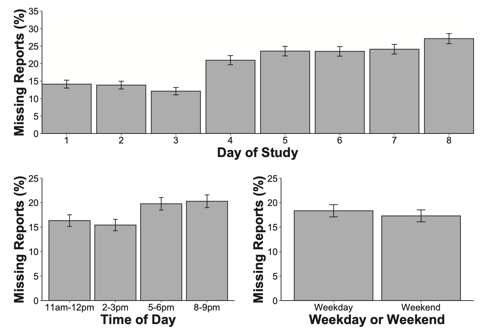
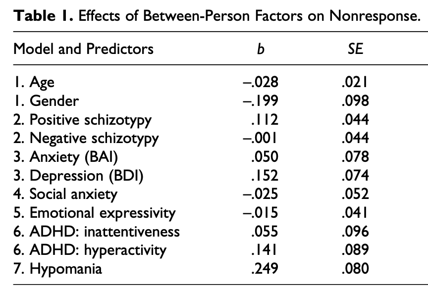
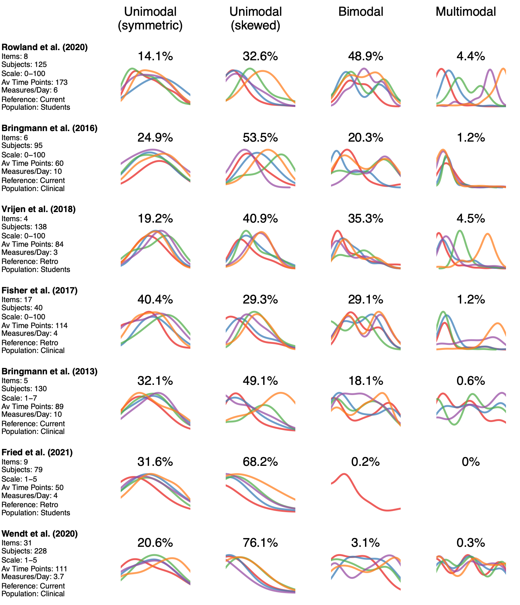

```{r setup, include=FALSE}
knitr::opts_chunk$set(echo = FALSE)
```

```{r, echo=FALSE, message=FALSE, warning=FALSE}
# Load packages
library(RColorBrewer)
library(plyr)
library(scales)
library(moments)
library(mgm)
library(qgraph)
library(mlVAR)

# Aux function for plotting:
PL <- function(tex, cex = 1.5, srt=0, x=0.45, y=0.5) {
  par(mar=rep(0,4))
  plot.new()
  plot.window(xlim=c(0,1), ylim=c(0,1))
  text(x, y, labels = tex, srt=srt, cex=cex, adj=0.25)
}

```


## Discussion of Time Series Analysis

### Questions:
1. Characterize Emotion Dynamics
2. Heterogeneity between people?
3. Effectiveness of intervention?

### Three Sessions:
1. Looking at data, descriptives, basic modeling (Jonas)
2. Modeling and model selection (Jerry)
3. Non-stationarity / trends and causality (Lourens)

... with Eiko chiming in here and there!

<br>


All analyses shown in this session are fully reproducible and available at [http://github.com/jmbh/NSMDworkshopMay22](http://github.com/jmbh/NSMDworkshopMay2022).


## The Example Dataset

Open data available from @rowland2020mind.

- Goal: study effect of mindfulness on affect network
- 125 undergraduate students
- 4 positive, 4 negative emotions
- 40 consecutive days
- six measures / day
- so, maximum of 240 measurements
- response scale: 0-100 analogue slider
- Two groups: Mindfulness intervention vs. Control


## The Example Dataset

```{r cars, echo = TRUE}
data <- readRDS("ESMdata.RDS")
head(data)
```

```{r, echo = TRUE}
length(unique(data$subj_id))
```


## Overall Missingness across Individuals

First check: Proportion of completed measurements across individuals:

```{r, fig.width=6, fig.height=5, fig.align="center"}
out <- ddply(data, .(subj_id), function(x) {
  mean(!is.na(x$happy))
})
hist(out$V1, xlim=c(0,1), xlab="Propotion Completed Measurements",
     breaks=seq(0, 1, length=30), main="")
```


## Missingness across time

```{r, fig.width=6, fig.height=6, fig.align="center"}
cols <- brewer.pal(5, "Set1")
plot.new()
plot.window(xlim=c(1,240), ylim=c(1,240))
axis(1, c(1, 50 ,100, 150, 200, 240))
axis(2, las=2, c(1, 50 ,100, 150, 200, 240))
title(xlab="Measurement Occasions", ylab="Number of measurements")
title(main="Cumulative measurements for 5 subjects", font.main = 1)
lines(1:240, col="grey", lwd=2)
u_subj <- unique(data$subj_id)
for(i in 1:5) {
  data_i <- data[data$subj_id==u_subj[i], ]
  miss_seq <- !is.na(data_i$excited)
  miss_seq_cs <- cumsum(miss_seq)
  lines(miss_seq_cs, col=cols[i], lwd=2)
}
legend("topleft", legend=c("No Missing", paste0("Subject ", 1:5)),
       col=c("grey", cols), lwd=rep(2, 6), bty="n")
```


## Length of missing sequences

```{r, fig.width=7, fig.height=3.5, fig.align="center"}
# Length of Missing Sequences
LengthMS <- function() {
l_ints <- list()
for(i in 1:125) {
  data_i <- data[data$subj_id==u_subj[i], ]
  v_NAseq <- c()
  c1 <- 0
  
  for(j in 1:239) {
    
    if(is.na(data_i$happy[j])) {
      c1 <- c1 + 1
    } else {
      v_NAseq <- c(v_NAseq, c1)
      c1 <- 0
    }
    
  } # end for: j
  
  l_ints[[i]] <- v_NAseq
  
} # end for: i
v_ints <- unlist(l_ints)
v_ints <- v_ints[!(v_ints==0)]
v_ints2 <- v_ints[v_ints<11] # subset

# Plot
par(mfrow=c(1,2))
par(mar=c(3,3,1,1))
hist(v_ints, breaks=seq(0, 50, length=50), xlab="Interval Size", main="")
barplot(table(v_ints2), xlab="Interval Size", ylab="Frequency")
}

LengthMS()
```

<br>

Most missing sequences are only a few measurement occasions long


## Length of missing sequences

```{r, fig.width=7, fig.height=3.5, fig.align="center"}
LengthMS()
```

<br>

Most missing sequences are only a few measurement occasions long

- "Good" for trend-type analyses
- "Bad" for lagged-effects-type analyses


## Is missingness random?

Time effects:

<br>


<br>

(from @sun2021eavesdropping)


## Is missingness random? II

Missingness is likely caused by the characteristics of people we are studying.



(from @silvia2013missed)

<br>

There are also results on dynamic predictors of missingness, see  @rintala2020momentary and @sun2021eavesdropping.


## Looking at Data

```{r, echo=TRUE}
head(data)
```

## Looking at Data: Time Series + Marginals

```{r, fig.width=8, fig.height=5, fig.align="center"}
TsMarg <- function() {
  # Subset 1 person
  i <- 1
  u_subj <- unique(data$subj_id)
  data_i <- data[data$subj_id==u_subj[i], ]
  X <- data_i$happy
  # Layout
  lmat <- matrix(1:2, nrow=1)
  layout(lmat, widths = c(1, .3))
  # Time Series
  par(mar=c(4,4,2,1))
  plot.new()
  plot.window(xlim=c(1,240), ylim=c(0,100))
  axis(1, c(0,50,100, 150, 200, 240))
  axis(2, las=2)
  abline(v=seq(0, 240, length=41), col="lightgrey", lty=2) # day indicator
  lines(X, col="black")
  title(xlab="Time", ylab="Response", main="Variable 'Happy'; Subject 1", font.main=1)
  # Marginals
  par(mar=c(4,0,2,.5))
  breaks <- seq(0, 100, length=30)
  tb <- hist(X, breaks=breaks, plot = FALSE)
  barplot(tb$counts, axes = FALSE, horiz = TRUE, ylab="")
}
TsMarg()
```

## Looking at Data: Time Series + Marginals

Heterogeneity: see [PDF](figures/Looking1_tsandmarginals.pdf)  


## Looking at Data: Bivariate

```{r, fig.width=6, fig.height=5, fig.align="center"}
i <- 2
u_subj <- unique(data$subj_id)
par(mar=c(4,4,1,1))
plot.new()
plot.window(xlim=c(0,100), ylim=c(0,100))
axis(1)
axis(2, las=2)
title(xlab="Happy", ylab="Sad", line=2.5, cex.lab=1.5)
u_subj <- unique(data$subj_id)
data_i <- data[data$subj_id==u_subj[i], ]
points(data_i$happy, data_i$sad, pch=20, col=alpha("black", alpha=.5), cex=2)
title(main=paste0("Subject: ", i), font.main = 1)
```


## Looking at Data: Bivariate

Heterogeneity: see [PDF](figures/Looking2_biv_happy_sad.pdf)  


## Descriptive Statistics: Mean & SD

```{r}
TsMargMSD <- function() {
  # Subset 1 person
  i <- 1
  u_subj <- unique(data$subj_id)
  data_i <- data[data$subj_id==u_subj[i], ]
  X <- data_i$happy
  # Layout
  lmat <- matrix(1:2, nrow=1)
  layout(lmat, widths = c(1, .3))
  # Time Series
  par(mar=c(4,4,2,1))
  plot.new()
  plot.window(xlim=c(1,240), ylim=c(0,100))
  axis(1, c(0,50,100, 150, 200, 240))
  axis(2, las=2)
  abline(v=seq(0, 240, length=41), col="lightgrey", lty=2) # day indicator
  lines(X, col="black")
  title(xlab="Time", ylab="Response", main="Variable 'Happy'; Subject 1", font.main=1)
  # Marginals
  par(mar=c(4,0,2,.5))
  breaks <- seq(0, 100, length=30)
  tb <- hist(X, breaks=breaks, plot = FALSE)
  barplot(tb$counts, axes = FALSE, horiz = TRUE, ylab="")
  sc <-  (100/29) #
  X_sc <- X / sc
  mean_X <- mean(X_sc, na.rm=TRUE) # scale to barplot
  sd_X <- sd(X_sc, na.rm=TRUE)
  abline(h=mean_X, col="blue", lwd=2)
  segments(x0 = 15, y0 = mean_X-5, x1=15, y1 = mean_X+5, lwd=2, lty=3, col="blue")
  segments(x0 = 10, y0 = mean_X-5, x1=20, y1 = mean_X-5, lwd=2, lty=3, col="blue")
  segments(x0 = 10, y0 = mean_X+5, x1=20, y1 = mean_X+5, lwd=2, lty=3, col="blue")
  
  text(8, 13, paste0("Mean = ", round(mean(X, na.rm=TRUE), 1)), adj=0, col="blue")
  text(8, 10, paste0("SD = ", round(sd(X, na.rm=TRUE), 1)), adj=0, col="blue")
}
TsMargMSD()
```

As always: means/SDs can be misleading if variables are not unimodal & symmetric.


## Heterogeneity in Mean & SD

```{r, fig.width=7, fig.height=5.5, fig.align="center"}
# --- Compute means/sds ---
m_res <- matrix(NA, 125, 4) # means (sad,happy), sds (sad, happy)
u_subj <- unique(data$subj_id)
for(i in 1:125) {
  data_i <- data[data$subj_id==u_subj[i], ]
  m_res[i, 1] <- mean(data_i$happy, na.rm=TRUE)
  m_res[i, 2] <- mean(data_i$sad, na.rm=TRUE)
  m_res[i, 3] <- sd(data_i$happy, na.rm=TRUE)
  m_res[i, 4] <- sd(data_i$sad, na.rm=TRUE)
}
# --- Figure ---
lmat <- matrix(5:8, nrow=2, byrow = TRUE)
lmat <- cbind(1:2, lmat)
lmat <- rbind(c(0,3,4), lmat)
lo <- layout(lmat, widths = c(.15, 1, 1), heights = c(0.15, 1, 1))
# Plot Labels
cex <- 1.8
PL("Mean", srt = 90, cex=cex)
PL("SD", srt = 90, cex=cex)
PL("Happy", cex=cex)
PL("Sad", cex=cex)
# Plot Data
par(mar=c(3,3,2,1))
breaks <- seq(0, 100, length=30)
for(i in 1:4) hist(m_res[, i], main="", xlim=c(0,100), 
                   xlab="", ylab="", breaks=breaks)

```


## Descriptive Statistics: Skewness & Modality

```{r, fig.width=7.5, fig.height=4.5, fig.align="center"}
par(mfrow=c(1,2))
i <- 1
u_subj <- unique(data$subj_id)
data_i <- data[data$subj_id==u_subj[i], ]
breaks <- seq(0, 100, length=30)
H <- hist(data_i$happy, xlim=c(0,100), 
          xlab="", ylab="", breaks=breaks, main="Happy (Subj 1)", font.main=1)
text(10, max(H$counts)*.9, paste0("Skewness = ", round(skewness(data_i$happy, na.rm=TRUE), 2)), adj=0)

i <- 5
u_subj <- unique(data$subj_id)
data_i <- data[data$subj_id==u_subj[i], ]
H <- hist(data_i$anxious, xlim=c(0,100), 
          xlab="", ylab="", breaks=breaks, main="Anxious (Subj 5)", font.main=1)
text(10, max(H$counts)*.9, paste0("Skewness = ", round(skewness(data_i$anxious, na.rm=TRUE), 2)), adj=0)
```


## Paper on Skewness & Modality {#margins}



<br><br><br>

Preprint: [https://psyarxiv.com/qudr6](https://psyarxiv.com/qudr6)


## Descriptive Statistics: RMSSD & AR

```{r}
TsMargMSD()
```

Variance captures only a small aspect of time evolution.

## Descriptive Statistics: RMSSD & AR

$\text{RMSSD} = \sqrt{\frac{1}{N}\sum_t^{N} (X_t - X_{t-1})^2 }$
$\;\;\;\;\;\;\;\;\;\;$
$\text{AR} = \text{cor}(X_t, X_{t-1})$

```{r, fig.width=7, fig.height=5.3, fig.align="center"}
## Make four examples
# Functions for AR/RMSSD
AR <- function(x) {
  cor(x[-1], x[-length(x)])
}
RMSSD <- function(x) {
  sqrt(mean((x[-1] -x[-length(x)])^2))
}
set.seed(6)
x <- 1:240
# Example 1: step function
y1 <- c(rep(40, 120), rep(60, 120))
# Example 2: Gaussian noise [matched to Example 1]
y2 <- rnorm(240, 50, 10)
# Example 3: AR model
y3 <- rep(40, 240)
for(i in 2:240) y3[i] <- 20 + 0.65*y3[i-1] + rnorm(1, 0, 5)
# Example 2: Random walk
y4 <- rep(50, 240)
for(i in 2:240) y4[i] <- 1*y4[i-1] + rnorm(1, 0, 3)
l_y <- list(y1, y2, y3, y4)
# Plotting
par(mfrow=c(2,2), mar=c(4,3,2,1))
for(i in 1:4) {
  plot.new()
  plot.window(xlim=c(1,240), ylim=c(0,100))
  axis(1, c(0,50,100, 150, 200, 240))
  axis(2, las=2)
  cex <- .95
  text(170, 100, paste0("SD = ", round(sd(l_y[[i]]),2)), adj=0, cex=cex)
  text(170, 90, paste0("AR = ", round(AR(l_y[[i]]),2)), adj=0, cex=cex)
  text(170, 80, paste0("RMSSD = ", round(RMSSD(l_y[[i]]),2)), adj=0, cex=cex)
  lines(x, l_y[[i]], lwd=2)
}
```


## Absolute model fit of AR model

```{r, fig.width=8.6, fig.height=3.5, fig.align="center"}
# Subset 1 person
i <- 1
u_subj <- unique(data$subj_id)
data_i <- data[data$subj_id==u_subj[i], ]
X <- data_i$happy
# Layout
lmat <- matrix(1:4, nrow=1)
layout(lmat, widths = c(1, .3, 1, .3))

TSplotARfit <- function(X, main=NULL) {
  # Time Series
  par(mar=c(4,4,2,1))
  plot.new()
  plot.window(xlim=c(1,240), ylim=c(-10,130))
  axis(1, c(0,50,100, 150, 200, 240))
  axis(2, las=2)
  abline(v=seq(0, 240, length=41), col="lightgrey", lty=2) # day indicator
  lines(X, col="black")
  title(xlab="Time", ylab="Response", main=main, font.main=1)
  # Marginals
  par(mar=c(4,0,2,.5))
  breaks <- seq(-10, 130, length=30)
  tb <- hist(X, breaks=breaks, plot = FALSE)
  barplot(tb$counts, axes = FALSE, horiz = TRUE, ylab="")
}

TSplotARfit(X, main="Variable 'Happy'; Subject 1")
```


```{r, echo=TRUE}
out <- lm(X[-1] ~ X[-length(X)])
out$coefficients
```


## Absolute model fit of AR model

```{r, fig.width=8.6, fig.height=3.5, fig.align="center"}
# Generate Data from AR model
set.seed(1)
X_sim <- rep(NA, 240)
X_sim[1] <- X[1]
coefs <- out$coefficients
for(i in 2:240) X_sim[i] <- coefs[1] + coefs[2]*X_sim[i-1] + rnorm(1, 0, sd(residuals(out)))

# Subset 1 person
i <- 1
u_subj <- unique(data$subj_id)
data_i <- data[data$subj_id==u_subj[i], ]
X <- data_i$happy
# Layout
lmat <- matrix(1:4, nrow=1)
layout(lmat, widths = c(1, .3, 1, .3))

TSplotARfit(X, main="Variable 'Happy'; Subject 1")
TSplotARfit(X_sim, main="Simulated data")
```

```{r, echo=TRUE}
set.seed(1)
X_sim <- rep(NA, 240)
X_sim[1] <- X[1]
coefs <- out$coefficients
res_sd <- sd(residuals(out))
for(i in 2:240) X_sim[i] <- coefs[1] + coefs[2]*X_sim[i-1] + rnorm(1, 0, res_sd)
```


## Absolute model fit of VAR model

```{r, fig.width=8, fig.height=5, fig.align="center"}
# Show Data
# ----- Select 2 PE, 2 NE -----
data_i <- data[data$subj_id==1, ]
data_i_vars <- data_i[, c("happy", "relaxed", "anxious", "sad")]
data_i_noNA <- na.omit(data_i)
data_i_noNA_vars <- data_i_noNA[, c("happy", "relaxed", "anxious", "sad")]

# ----- Show data -----
# Layout
lmat <- matrix(1:8, nrow=2, byrow = TRUE)
lo <- layout(lmat, widths = c(1, .3, 1, .3))
# layout.show(lo)
TSplotARfit(data_i$happy, main="Happy")
TSplotARfit(data_i$relaxed, main="Relaxed")
TSplotARfit(data_i$anxious, main="Anxious")
TSplotARfit(data_i$sad, main="Sad")

```

## Absolute model fit of VAR model

```{r, echo=FALSE, message=FALSE, warning=FALSE, fig.width=5.5, fig.height=4.5, fig.align="center"}

# ----- Fit VAR -----
out <- mvar(data=data_i_noNA_vars,
            type=rep("g", 4),
            level=rep(1, 4),
            lags = 1,
            lambdaSel = "EBIC",
            lambdaSeq = 0,
            dayvar = data_i_noNA$dayno,
            beepvar = data_i_noNA$beep,
            threshold = "none",
            scale=FALSE, 
            pbar=FALSE, signInfo = FALSE)

# intercepts
ints <- unlist(out$intercepts)

# phi-matrix
out$signs[is.na(out$signs)] <- 1
phi <- out$wadj[, , 1] * out$signs[, , 1]

# residual variances
pred <- predict(out, data=data_i_noNA_vars,
                dayvar = data_i_noNA$dayno,
                beepvar = data_i_noNA$beep)
res <- pred$predicted - data_i_noNA_vars
cov_res <- cov(res)

# ----- Make Graph -----
qgraph(phi, labels=colnames(data_i_noNA_vars), edge.labels=T)

```

```{r, echo=TRUE}
round(ints, 2) # Intercepts
```


## Absolute model fit of VAR model

```{r, fig.width=8.25, fig.height=4, fig.align="center"}
# ----- Generate Data -----

set.seed(14)
data_sim <- simulateVAR(pars = phi, means = ints,
                        Nt = 240,
                        init = as.numeric(data_i_noNA_vars[1,]),
                        residuals = cov_res) # inital values

# Combine into array
l_data <- list(data_i_vars, data_sim)

# ----- Plot Figure -----
par(mfrow=c(1,2))

# Empirical data
lim <- c(-20,120)
par(mar=c(4,4,1,1))
plot.new()
plot.window(xlim=lim, ylim=lim)
axis(1)
axis(2, las=2)
abline(h=c(0,100), col="grey")
abline(v=c(0,100), col="grey")
title(xlab="Happy", ylab="Sad", line=2.5, cex.lab=1.5)
points(data_i$happy, data_i$sad, pch=20, col=alpha("black", alpha=.5), cex=2)
title(main=paste0("Subject: 1"), font.main = 1)

# Simulated data
par(mar=c(4,4,1,1))
plot.new()
plot.window(xlim=lim, ylim=lim)
axis(1)
axis(2, las=2)
abline(h=c(0,100), col="grey")
abline(v=c(0,100), col="grey")
title(xlab="Happy", ylab="Sad", line=2.5, cex.lab=1.5)
points(data_sim[, 1], data_sim[, 2], pch=20, col=alpha("black", alpha=.5), cex=2)
title(main="Simulated Data", font.main = 1)

```

- Useful summary of the data (conditional autocorrelations and cross-correlations)
- But: Unlikely a (good approximation of a) generating mechanism


## Descriptive vs. Generative Models

- How can we use statistical models if they are no plausible generating/mechanistic models?

<br>

An illustration of the issue:

Haslbeck, J. M., & Ryan, O. (2021). Recovering within-person dynamics from psychological time series. *Multivariate Behavioral Research*, 1-32. [LINK](https://www.tandfonline.com/doi/full/10.1080/00273171.2021.1896353)

<br>

Some ideas on how to move forward:

Haslbeck, J., Ryan, O., Robinaugh, D. J., Waldorp, L. J., & Borsboom, D. (2021). Modeling psychopathology: From data models to formal theories. *Psychological Methods*. [LINK](https://psycnet.apa.org/fulltext/2022-00806-001.html)


## Summary {#margins}

### **Missingness**

- Many ways to analyze it
- Can be seen as data/behavior

### **Looking at Data** 

- Critical to do before modeling
- Many discoveries: Modality, skewness, low variance, huge heterogeneity, etc.

### **Descriptives**

- Mean, SD, RMSSD, Skew, Modality
- Can provide powerful characterization of data

### **Basic Modeling**

- AR, VAR
- Distinction: Descriptive & generative models


## References


